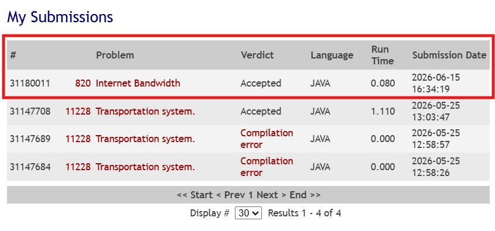

# Trabalho Prático 3 - Unidade 3: Fluxo Máximo em Redes

**Grupo G**
* **Problema:** [UVA 820 - Internet Bandwidth](https://onlinejudge.org/external/8/820.pdf)
* **Linguagem:** Java
* **Integrantes do Grupo:** * [Tales Rodrigues da Costa Sales Rios]
  * [Pedro Nobre]
  * [Gustavo do Patrocínio]

---

## 🚀 Como Executar a Solução

A nossa implementação (`src/Main.java`) foi projetada com um redirecionamento inteligente de entrada para facilitar o desenvolvimento local sem quebrar a submissão no juiz online.

### 💻 Execução Local (VS Code / IDEs)
No ambiente local, o código procura automaticamente pelo arquivo de texto contendo os casos de teste.
1. Certifique-se de abrir a pasta raiz do projeto (`T3/`) no VS Code.
2. O arquivo de entrada deve estar em `dados/entradas_do_problema.txt`.
3. Compile e execute o arquivo `src/Main.java`. O Java lerá os dados do arquivo `.txt` e imprimirá a saída no console.

### 🌐 Submissão no UVA Online Judge
Ao submeter no site do UVA, basta enviar o conteúdo exato do arquivo `Main.java`.
* **Como funciona:** O servidor do UVA não possui a pasta `dados/`. O código verifica se o arquivo local existe; como no servidor ele não existe, o programa automaticamente ignora o arquivo e passa a ler da entrada padrão (`System.in`), o que garante o veredito **Accepted** sem precisar alterar nenhuma linha de código antes de enviar.

---

## 🧠 Modelagem como Rede de Fluxo

O problema consiste em descobrir a largura de banda máxima que pode trafegar entre dois computadores, o que é uma aplicação direta de **Fluxo Máximo**.

* **Vértices ($V$):** Representam os computadores (nós) da rede, numerados de $1$ a $n$.
* **Origem ($s$) e Sorvedouro ($t$):** Representam, respectivamente, o nó de onde os dados partem e o nó de destino, ambos especificados dinamicamente em cada caso de teste.
* **Arestas e Capacidades:** O enunciado define que as conexões (cabos) são **bidirecionais**. Para modelar isso em um grafo direcionado, cada cabo conectando $u$ e $v$ com banda $b$ é modelado como **duas arestas direcionadas**:
  * $u \rightarrow v$ com capacidade $b$.
  * $v \rightarrow u$ com capacidade $b$.

### Resultado do Fluxo
Como não há necessidades extras (como corte mínimo ou emparelhamento), o valor numérico do fluxo máximo alcançado no sorvedouro é **diretamente a resposta do problema** (a largura de banda máxima da rede).

---

## ⚙️ Algoritmo Utilizado e Grafo Residual

O algoritmo escolhido foi o **Edmonds-Karp**.
Decidimos utilizar a Busca em Largura (BFS) para encontrar os caminhos aumentantes, em vez da Busca em Profundidade (DFS) do Ford-Fulkerson clássico. Isso evita o risco de o algoritmo encontrar caminhos ineficientes que aumentam o fluxo em pequenas quantidades, o que poderia causar *Time Limit Exceeded* (TLE) em redes com capacidades de banda muito altas.

### O Papel do Grafo Residual
Utilizamos uma matriz de adjacência (`cap[][]`) para representar tanto as capacidades originais quanto o grafo residual simultaneamente. 
Ao empurrar um fluxo de valor $F$ por um caminho $u \rightarrow v$:
1. Subtraímos $F$ da aresta direta (`cap[u][v] -= F`), reduzindo a capacidade disponível.
2. Somamos $F$ na **aresta reversa** (`cap[v][u] += F`). Isso é fundamental porque permite que o algoritmo "desfaça" uma decisão ruim no futuro, enviando o fluxo de volta caso encontre uma rota globalmente mais otimizada.

---

## ⏱️ Análise de Complexidade

* **Tempo:** O algoritmo de Edmonds-Karp garante que o número de caminhos aumentantes seja no máximo $\mathcal{O}(V \cdot E)$. Como cada BFS custa $\mathcal{O}(E)$, a complexidade de tempo total do algoritmo no pior caso é **$\mathcal{O}(V \cdot E^2)$**. Dado que o problema restringe $N \le 100$, a solução roda com bastante folga dentro do limite de tempo do juiz online.
* **Espaço:** Utiliza **$\mathcal{O}(V^2)$** devido ao uso da matriz de adjacência de tamanho $101 \times 101$ e do array de parentescos da BFS, o que é extremamente leve em termos de memória.

---

## ⚠️ Casos Especiais Tratados

1. **Arestas Paralelas (Múltiplos Cabos):** O problema permite múltiplos cabos conectando o mesmo par de nós. Tratamos isso somando as capacidades na matriz de adjacência (`cap[u][v] += bandwidth`).
2. **Capacidade Bidirecional Inicial:** Diferente de fluxos padrão onde a aresta reversa inicia em zero, aqui atualizamos *ambos* os sentidos na leitura da entrada com a banda máxima, pois os dados podem trafegar fisicamente nos dois sentidos.
3. **Múltiplos Casos de Teste:** O programa utiliza um loop `while` lendo até encontrar a condição de parada $N = 0$, instanciando uma nova rede a cada iteração.
4. **Fast I/O em Java:** Utilizamos `BufferedReader` e `StringTokenizer` para garantir leitura rápida e evitar problemas de tempo de execução gerados pela classe `Scanner`.

---

## ✅ Evidência de Submissão

O código foi submetido na plataforma original (UVA Online Judge) obtendo sucesso.

  

---

## 🎥 Apresentação
[[Link para o vídeo da apresentação aqui](https://drive.google.com/drive/folders/1kACneJcbMfOmFbaW82cfeT5iEI-7QT1u?usp=sharing)]
